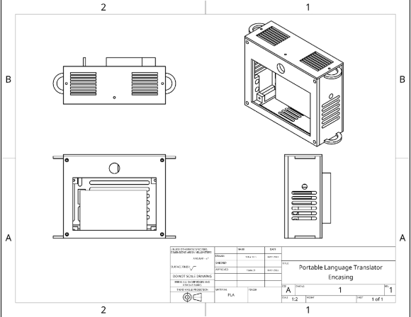
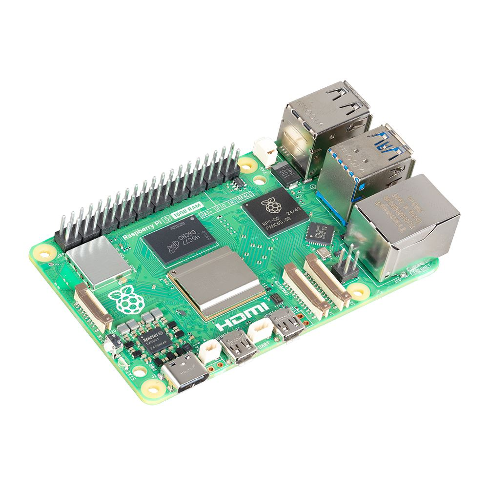
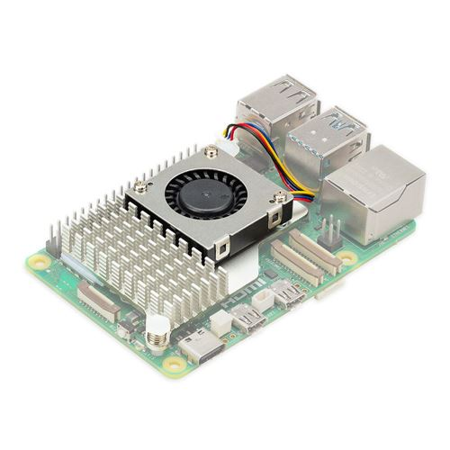
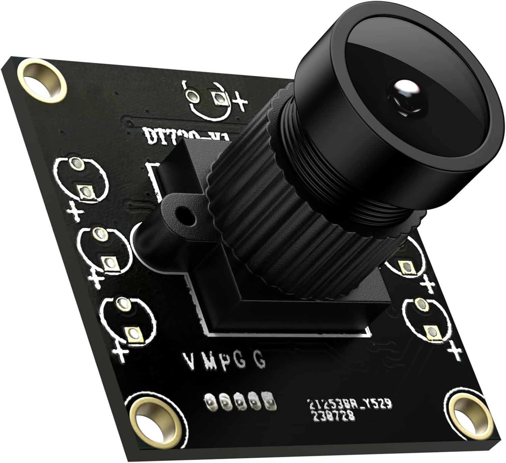
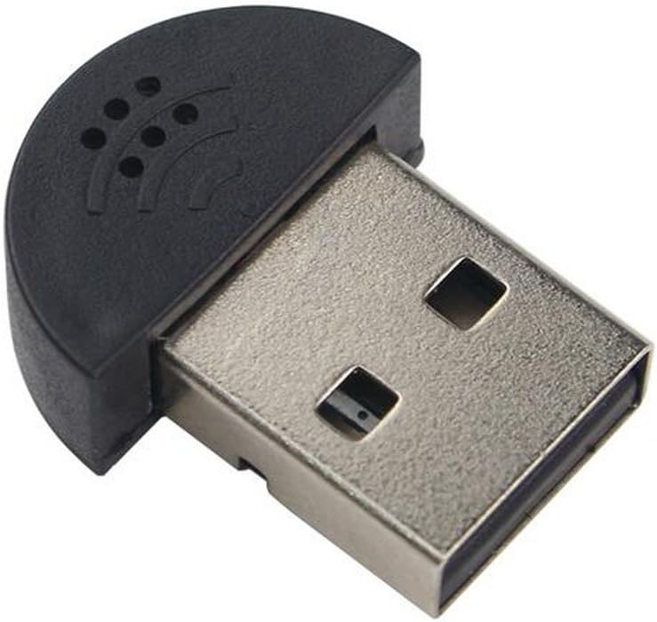
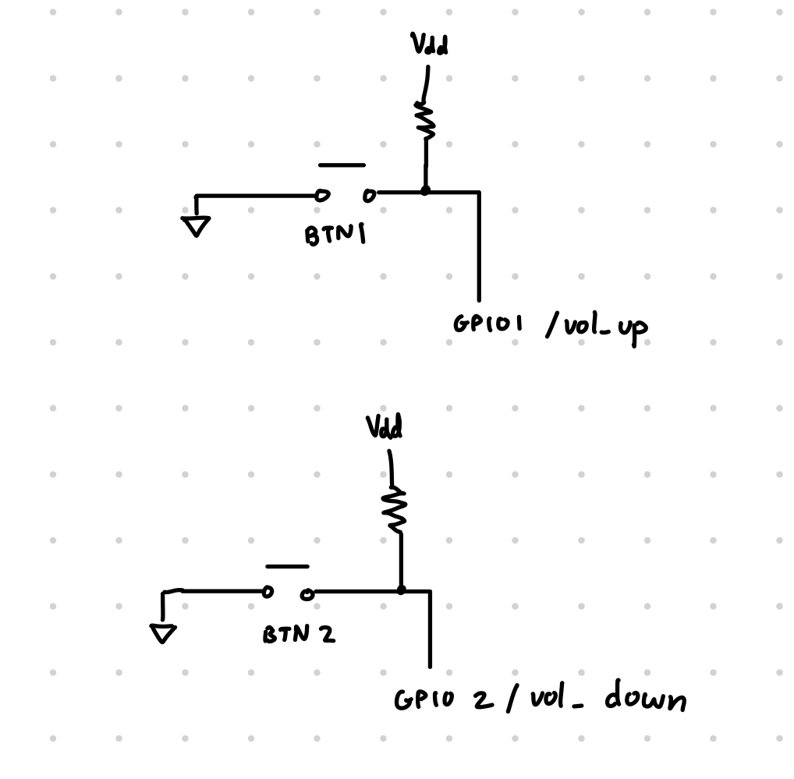
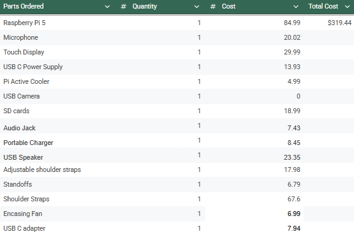

# Hardware

## CAD Designs
All relevant drawings are included in the cad_files directory. It includes all the stl files but also all images of the drawings. The 3D prints work together to make one final encasing. 

Bill of Materials

Specifically, we created 4 relevant components to the final encasing. They includes a backplate, frontplate, lid, and a mount.

#### Mount
The mount acts as the basis for the encasing. It permits the mounting of all relevant components of the device. Specifically there are specific locations for the camera, display, and Raspberry Pi to interface with. 
* [Mount Visual](./cad_files/Mount_3D_Drawing.pdf)
* [Mount STL File](./cad_files/Display_Mount.stl)

#### Backplate
The backplate serves as a cover for the internal electrical components. Despite being a cover it provides for open grating such that the device can properly ventilate hot air generated from the Raspberry Pi. Additional it acts as mounting point for the battery back. 
* [Backplate Visual](./cad_files/Back_Plate_3D_Drawing.pdf)
* [Backplate STL File](./cad_files/Back_Plate.stl)

#### Frontplate
The frontplate is used to mount the display in place while making a flush finish for the camera and display. 
* [Frontplate Visual](./cad_files/Front_Plate_3D_Drawing.pdf)
* [Frontplate STL File](./cad_files/Front_Plate.stl)

#### Lid
The lid is used to cover the sytem speakers with some grating to allow clear audio to be output from the device.
* [Lid Visual](./cad_files/Mount_3D_Drawing.pdf)
* [Lid STL File](./cad_files/Display_Mount.stl)

## Primary Hardware Components
The main hardware components to consider include a USB camera, speaker, and camera, buttons, Raspberry Pi 5, touchscreen display, and battery pack.

#### Raspberry Pi 5 and Active Cooler
The Raspberry Pi 5 acted as the primary processing device. It handled connectiving to internet and communicating with the Google Translate API. Furthermore it connects to all relevant peripherals of the device including the USB devices, buttons, and display in order to orchestra all relevant interactions.

Raspberry Pi 5

Despite observing high performance guarantees from the Raspberry Pi 5, we noticed high temperatures from the system. Due to this we invested in a cooling system for the device in the form of the Raspberry Pi 5 Active Cooler.

Active Cooler for Raspberry Pi 5

#### USB Camera
The USB Camera is directly connected to the USB hub on the Raspberry Pi 5. It mainly acts as an input feed to be fed into our ASL translation model.

USB Camera

#### USB Speaker
The USB Speaker is directly connected to the USB hub on the Raspberry Pi 5. It acts as an output medium for translations.

USB Camera

#### USB Microphone
The USB Microphone is directly connected to the USB hub on the Raspberry Pi 5. It mainly acts as an input feed to be fed into our Language Translation Software.

USB Microphone

#### Buttons
The buttons are setup with hardware interrupts in order to control volume and mode toggling. These are connected to GPIO Pins 4, 17, and 27. Specifically these buttons are pulled high via an internal pull up resistor. When the software detects that the state has been pulled to GND, it will triggered the attached interrupt event.

Button Implementation

#### Touchscreen Display
The touchscreen display is power and connected via a DSI cable. It allows for a direct connection to the Pi homescreen and allows viewing of our User Interface.

Touchscreen

## System Inside Enclosure

## Device Setup

## Bill of Materials (BOM)

Bill of Materials

Above we see the list of necessary components for the project totaling to $319.44. 

## Vendors and Relevant Data Sheets
Below we have included all relevant links for the parts purchased for our device. This includes links to the sites where we purchased from but also relevant documentation cites for the devices.

Note: For components from Amazon most documentation and specification are already embedded within the amazon link

* Camera [(Amazon)](https://www.amazon.com/dp/B0CLRJZG8D?ref=ppx_yo2ov_dt_b_fed_asin_title) 

* Microphone [(Amazon)](https://www.amazon.com/KISEER-Microphone-Desktop-Recording-YouTube/dp/B071WH7FC6/ref=asc_df_B071WH7FC6?mcid=f4860cb3cb503172a9b603585b46b544&tag=hyprod-20&linkCode=df0&hvadid=693275687940&hvpos=&hvnetw=g&hvrand=6500147408867249018&hvpone=&hvptwo=&hvqmt=&hvdev=c&hvdvcmdl=&hvlocint=&hvlocphy=1018127&hvtargid=pla-1020889203544&psc=1)

* Speaker [(Amazon)](https://www.amazon.com/HONKYOB-Speaker-Computer-Multimedia-Notebook/dp/B075M7FHM1?dib=eyJ2IjoiMSJ9.MFYwa2uzXIFsG18mReFDjxbpKMhSuzYr2lb1G5xRCLT0rbMtm4dvs9Ga1Hc8n7e9OLKEJvzPb35JNz6K2TsQHj0Ws3R_0S7DnxglfEWjZgln7kvScWg956m740ZfCkACHxxDcvegteYQKzW7hyzwJigRPt54XTF4iu33T-L4S2A7tTAUW_lHLQ-s09nWVBNYdvp4kAzMXRU189WbVQqn-WAIAzV7X8L2R348afNRwNE.n3F1cbqfsc0PsLw3v4-JexdaEbBrpqAOPzH6oMFroZE&dib_tag=se&keywords=usb%2Bspeaker&qid=1740022962&sr=8-11&th=1)

* Raspberry Pi 5 [(Microcenter)](https://www.microcenter.com/product/688718/product?src=raspberrypi) and [additional documentation](https://www.raspberrypi.com/products/raspberry-pi-5/)

* Raspberry Pi Active Cooler [(Microcenter)](https://www.microcenter.com/product/671930/raspberry-pi-5-active-cooler?src=raspberrypi) and [additional documentation](https://www.raspberrypi.com/products/active-cooler/)

* Touchscreen  [(Amazon)](https://www.amazon.com/Hosyond-Touchscreen-Compatible-Capacitive-Driver-Free/dp/B0CXTFN8K9/ref=sr_1_3?dib=eyJ2IjoiMSJ9.W5A_3BEZuul4IaYNDccoJFOManlSQWpIhG3mbyjJTNi84sK06TFx-uHWgq6lHRvXeJt43y0tjhIRwkEVNi1Gu6oSUnOUlzBB2S7tvW3p74IkM6ZaqIxWgAR3Es3EdREfMToFNrp6c3qxBpp1usB4aSc-MtWFl3AIC_s5UeHZ2nG8WwjwB0qRPSWgVXGfLc2m8ptSCLKz9n6bi7L1K4Vb5_l-kKT7ZV5y5s8TNTGtqwE.rErZqmdNf7EPrqVTRG8emFXKop97Z8c84gxk9MwWxQQ&dib_tag=se&hvadid=409914306192&hvdev=c&hvlocphy=9002000&hvnetw=g&hvqmt=e&hvrand=7933609843381280057&hvtargid=kwd-296167253220&hydadcr=18063_11398767&keywords=raspberry+pi+touchscreen+5+inch&mcid=3562c2f5c72c346192db74c03ccd74b0&qid=1745798170&sr=8-3)

* Battery Pack [(Amazon)](https://www.amazon.com/SIXTHGU-Portable-Capacity-External-Indicator/dp/B08QHG1SWY/ref=sr_1_8?crid=DOLC2T4HS6KY&dib=eyJ2IjoiMSJ9.uuhowUIjWXMkCx6YtoYGN-1zMLDAkzA3C7xi2NSJT65CY8yDMGxVXEOc645IfDJzl1oS1dlCStYFc7UHfsa6ln9eMxBMo7lW0xhpAVg5eBLVMaiKDJ-O0cnaQOJwJm3FEr9DmTi4vsP5hxWtVgj-H_FlnOLTLEv2zppmr-MTelANZdg4iDN4N4smNhLcTqSi7dstNntyptXGONH706f2Pr2qD-6i72Y36o2Ya83ARrE.LnGPn8wsZ6h4JCJCgOMStyyye3gnpm0BzS_TSaumpoM&dib_tag=se&keywords=5000%2Bmah%2Bpower%2Bbank&qid=1739759561&sprefix=5000%2BmAh%2Caps%2C108&sr=8-8&th=1)

## Power Requirements
The main power requirements for our device pertain to the battery pack. The battery pack provided with the design is a 5V, 5000mAh, with a max current draw of approximately 2.4A. Under the highest stress out device consumes approximately 1.6A of current. With these considerations at max performance our device would last 3.125 hours. 

The user is free to incorporate their own battery pack if they desire to achieve a longer battery life. As long as the battery pack can properly supply power to the Raspberry Pi with a voltage of 5V, and a minimum current of 1.6A any other power source can be used to drive the device. A wall plug would also be sufficient in cases where the user doesn't plan on moving the device.

