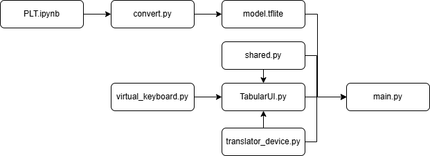

# Software Modules Overview

## Main.py

### Overview
Main.py file serves as the main controller for the Portable Language Translator. It integrates ASL gesture recognition, speech processing, and hardware control. It uses TensorFlow Lite for ASL recognition, MediaPipe for pose detection, and a custom class that uses Google Cloud for speech processing. The system operates in two modes: ASL and Speech. 

### Core Framework and Dependencies
The system integrates multiple key libraries including TensorFlow, MediaPipe, OpenCV, and PyQt5 to create a custom solution to automatically translate speech and detect ASL gestures. The code uses multiple threads to handle simultaneous ASL processing, inference, and translation operations.

### ASL Gesture Recognition Components
The ASL recognition system uses MediaPipe to get hand and pose landmarks and a TensorFlow Lite Long Short Term Memory model for gesture classification. Key functions include:

```python
def tflite_predict(sequence):
    """Run TFLite inference on a given input sequence."""
    sequence = np.expand_dims(sequence, axis=0).astype(np.float32)
    interpreter.set_tensor(input_details[0]['index'], sequence)
    interpreter.invoke()
    return interpreter.get_tensor(output_details[0]['index'])[0]

def mediapipe_detection(image, model):
    """Runs MediaPipe Holistic on a frame and returns the drawn image and results."""
    image_rgb = cv2.cvtColor(image, cv2.COLOR_BGR2RGB)
    image_rgb.flags.writeable = False
    results = model.process(image_rgb)
    image_rgb.flags.writeable = True
    drawn_frame = cv2.cvtColor(image_rgb, cv2.COLOR_RGB2BGR)
    return drawn_frame, results
```

### Mode Control
The system operates in two modes, ASL and Speech, with a physical button to toggle between them. The change_mode() function handles the transition between modes:

```python
def change_mode():
    global mode, cap, sequence, predictions, sentence
    # Flush ASL buffers/queues
    while not sequence_queue.empty():
        sequence_queue.get_nowait()
    while not result_queue.empty():
        result_queue.get_nowait()
    sequence.clear()
    predictions.clear()
    sentence.clear()
    
    cv2.destroyAllWindows()
    if mode == "ASL":
        mode = "SPEECH"
        speech_mode_logic()
        if cap is not None:
            cap.release()
            cap = None      
        print("Mode changed to SPEECH")
        translator_device.reset()
        translator_device.active = True
        shared.ui_mode = "TEXT"
    else:
        mode = "ASL"
        with open(file_path, 'w') as file:
            pass  # clear the file contents
        asl_mode_logic()
        if cap is None:
            cap = cv2.VideoCapture(0)
        print("Mode changed to ASL")
        shared.ui_mode = "CAMERA"

    shared.mode = mode
```

### Multithreading
The system has several concurrent threads for processing:
ASL Inference Thread - Processes gesture sequences asynchronously
Translator Thread - Handles speech recognition and translation
ASL Processing Thread - Manages camera input and ASL detection pipeline

```python
asl_thread = threading.Thread(target=inference_worker, daemon=True)
asl_thread.start()

translator_thread = threading.Thread(target=translator_device.start, daemon=True)
translator_thread.start()

asl_proc_thread = threading.Thread(target=asl_processing_loop, daemon=True)
asl_proc_thread.start()
```

### Hardware Integration
The code interfaces with physical buttons for mode control and volume adjustment:
```python
button_mode = Button(PIN_MODE, pull_up=True, bounce_time=0.2)
button_up = Button(PIN_UP, pull_up=True, bounce_time=0.2)
button_down = Button(PIN_DOWN, pull_up=True, bounce_time=0.2)

button_mode.when_pressed = change_mode
button_up.when_pressed = volume_up
button_down.when_pressed = volume_down
```

### Main Processing Loop
The ASL processing loop continuously captures frames, processes them through MediaPipe, extracts keypoints, and performs inference:

```python
def asl_processing_loop():
    # Processes ASL gestures in real-time using the camera
    # Extracts pose landmarks, performs inference, and updates UI elements
    # Maintains a history of predictions to ensure consistent recognition
    # Synthesizes speech when a complete gesture sequence is detected
```

### Application Entry Point
The main function initializes the UI component and manages the application lifecycle:

```python
if __name__ == "__main__":
    file_path = "als_speech_audio_transcription.txt"
    with open(file_path, 'w') as file:
        pass  # clear the file contents

    app_qt = QApplication(sys.argv)
    window = MainWindow(file_path, translator_device)
    window.show()
    try:
        exit_code = app_qt.exec_()
    except KeyboardInterrupt:
        exit_code = 0
    finally:
        cleanup()
    sys.exit(exit_code)
```


### Shared.py
This file is used as a place for global variables that need to be accessed across different modules in the Portable Language Translator project. This allows for easy state management between the different components.

### Key Variables
- latest_frame
    - Stores the most recently captured camera frame from the ASL processing loop
    - Used by the UI to display the camera feed with pose landmarks
    - Initially set to None until the first frame is captured
- mode
    - Tracks the current operating mode of the device
    - Can be either "SPEECH" (for voice translation) or "ASL" (for sign language recognition)
    - Initially set to "SPEECH" as the default mode
- ui_mode
    - Controls what content should be displayed in the UI
    - Can be "CAMERA" (showing the camera feed with pose detection) or "TEXT" (showing translated text)
    - Used by TabularUI to determine which widget to display

## Translator_device.py
This file creates a TranslatorDevice class with useful functionalities surrounding audio transcription and translation. Some important functions are highlighted below:

### `__init__`
In the class initialization, many settings are set and can be customized. Specifications on audio sample rates, voice sensitivity, possible languages, voice settings, and thread and client setup are done here.

### VAD_collector
The class used a VAD (voice activity detection) library to control the conversation flow. Audio is processed in chunks and voice is detected in each chunk using the VAD library whose sensitivity can be changed in the initialization. The VAD waits until it detects a chunk with voice and then ends and sends the audio stream once there is a chunk detected without voice activity to better match conversation flow.

### Transcribe_and_translate
This is the main functionality of the class. This function takes in the audio chunk, sends it to Google Cloud API to detect the language from the list of possible languages and transcribe the audio. Once that is done it translates the text and sends back the result where it is then taken by other functions to create the audio playback of the translated text.

### Set_settings
This function is used to set the base language of the device and the voice gender preferences.

### Start
This function is used the start the audio input stream.

### Listen_and_save_transcription
This function is used by the ASL mode to take in audio and save the transcribed text to a file to be later displayed on screen.


## virtual_keyboard.py
virtual_keyboard.py creates a class called VirtualKeyboard. This is used in a section of the UI, specifically in the second tab for WiFi Connectivity. This is essentially done by creating a Qwidget object that organizes a grid of push buttons that contain relevant keyboard inputs for entering WiFi credentials. On pressing a button it will respond by populating the relevant textbox for entering credentials. The relevant keyboard declaration and creation is highlight below.


```python
self.keys = [
            ['1', '2', '3', '4', '5', '6', '7', '8', '9', '0'],
            ['q', 'w', 'e', 'r', 't', 'y', 'u', 'i', 'o', 'p'],
            ['a', 's', 'd', 'f', 'g', 'h', 'j', 'k', 'l', '←'],
            ['↑', 'z', 'x', 'c', 'v', 'b', 'n', 'm', '␣']
        ]


        keyboard_frame = QFrame()
        keyboard_frame.setStyleSheet("background-color: #333; border-radius: 10px; padding: 10px;")
        grid_layout = QGridLayout()


        for row_idx, row in enumerate(self.keys):
            for col_idx, key in enumerate(row):
                btn = QPushButton(key.upper() if self.caps_lock else key)
                btn.setFixedSize(50, 50)
                btn.setStyleSheet(self.get_button_style(key))
                btn.clicked.connect(lambda checked, k=key: self.key_pressed(k))
                grid_layout.addWidget(btn, row_idx, col_idx)
                self.buttons[key] = btn
```


## TabularUI.py
Our TabularUI.py script is in charge of setting up our user interface. Specifically we have our code organized as three seperate tabs, each of which has its own functionality. Tab 1 is in charge of general translation functionality. Tab 2 is in charge of WiFi connectivity. Tab 3 is used for settings control. All initialization and setup is done in the class method initUI(self).


``` python
def initUI(self):
        self.tabs = QTabWidget()
        self.tabs.setStyleSheet("""QTabWidget::pane { border: 1px solid #aaa; background: #ddd; }
                                  QTabBar::tab { padding: 6px; font-size: 10px; background: #eee; color: black; border: 1px solid #aaa; }
                                  QTabBar::tab:selected { background: #ccc; }""")
       
        # Create Tabs
        self.tab1 = QWidget()
        self.tab2 = QWidget()
        self.tab3 = QWidget()
       
        # Add tabs to the QTabWidget
        self.tabs.addTab(self.tab1, "Translation")
        self.tabs.addTab(self.tab2, "Wi-Fi")
        self.tabs.addTab(self.tab3, "Settings")
       
        # Set up layouts for each tab
        self.setupTab1()
        self.setupTab2()
        self.setupTab3()
       
        self.setCentralWidget(self.tabs)
```


1. First Tab (Translation)
The first tab is comprised of a few components to enable translation functionality. It consists of a status label, video label, a text editor. The class method setupTab1() sets up the Widgets such that the status label shows the current functional mode of the device, either "SPEECH" or "ASL". The video label will show the live camera feed when in ASL mode, and the text editor will give text translations in both user modes.


2. Second Tab (WiFi Connectivity)
The second tab setups various components to allow the device to connect to internet using the class method setupTab2(). It initializes the VirtualKeyboard class and then creates various textboxes to allow the user to enter relevant SSID and passwords for the internet they are trying to connect to.


3. Third Tab (Settings)
The third and final tab setups widgets for a volume indicator, language mode buttons, voice settings dropdown. This is created using the setupTab3() method.

## model.tflite
This file is a Long Short Term Memory model based off of TensorFlow that has been converted to TensorFlow Lite to be used forASL recognition. This model is designed to recognize a predefined set of ASL gestures in real time from video input. 

## Convert.py
This file is used to convert the keras model into a smaller tflite file for deployment.

## PLT.ipynb
This notebook file contains the process for building and training the Long Short Term Memory (LSTM) neural network that allows for ASL recognition. It has data collection, preprocessing, model creation, training, and evaluation.

### Key Components

#### Environment Setup
First install necessary dependencies and import libraries
```
!pip install tensorflow opencv-python mediapipe scikit-learn matplotlib
```
```python
import cv2
import numpy as np
import os
import mediapipe as mp
import matplotlib.pyplot as plt
```

#### Data Collection Pipeline
Data collection is done with multiple workflows:

##### MediaPipe Setup
```python
mp_holistic = mp.solutions.holistic # Holistic model
mp_drawing = mp.solutions.drawing_utils # Drawing utilities
```

##### Helper Functions
mediapipe_detection: Processes video frames through MediaPipe
draw_styled_landmarks: Visualizes pose and hand landmarks
extract_keypoints: Converts MediaPipe results to feature vectors

##### Data Structure Definition
The actions array contains the gestures the ASL model will collect data for and train. Each training video will be 30 frames per sequence. 
```python
# ASL gestures to recognize
actions = np.array(['hello', 'thanks', 'nothing', 'help', 'yes', 'bathroom'])

# 30 frames per sequence
sequence_length = 30
```

##### Data Collection Loop
The notebook will record and collect data by:
Creates directories for each gesture
Captures 30-frame sequences for each example
Extracts pose and hand landmarks using MediaPipe
Saves landmark data as NumPy files
Provides visual feedback during recording
This will create a dataset with the following structure:
```
MP_Data/
  hello/
    0/
      0.npy, 1.npy, ..., 29.npy
    1/
      0.npy, 1.npy, ..., 29.npy
    ...
  thanks/
    ...
```

#### Data Preprocessing
After data has been collected, it will then be processed for model training:
```python
# Load sequences and create labels
sequences, labels = [], []
for action in actions:
    for sequence in np.array(os.listdir(os.path.join(DATA_PATH, action))).astype(int):
        window = []
        for frame_num in range(sequence_length):
            res = np.load(os.path.join(DATA_PATH, action, str(sequence), f"{frame_num}.npy"))
            window.append(res)
        sequences.append(window)
        labels.append(label_map[action])

# Convert to numpy arrays and one-hot encode labels
X = np.array(sequences)
y = to_categorical(labels).astype(int)

# Split into train/test sets
X_train, X_test, y_train, y_test = train_test_split(X, y, test_size=0.05)
```

#### LSTM Model Architecture
The model will use a stack LSTM architecture:
```python
model = Sequential([
    Input(shape=(30, 258)),
    LSTM(64, return_sequences=True, activation='tanh'),
    LSTM(128, return_sequences=True, activation='tanh'),
    LSTM(64, return_sequences=False, activation='tanh'),
    Dense(64, activation='relu'),
    Dense(32, activation='relu'),
    Dense(actions.shape[0], activation='softmax')
])
```

#### Training Process
The LSTM model is trained with:
```python
model.compile(optimizer='Adam', loss='categorical_crossentropy', metrics=['categorical_accuracy'])
model.fit(X_train, y_train, epochs=100, callbacks=[tb_callback])
```

#### Model Evaluation
Once the LSTM model has been trained, the model performance is evaluated with:
```python
yhat = model.predict(X_test)
ytrue = np.argmax(y_test, axis=1).tolist()
yhat = np.argmax(yhat, axis=1).tolist()

# Confusion matrix for detailed performance analysis
multilabel_confusion_matrix(ytrue, yhat)

# Overall accuracy
accuracy_score(ytrue, yhat)
```

#### Model Export
Once the model has been trained and evaluated it is saved to be used later in the main application.
```python
model.save(‘model.keras’)
```

# Flow Chart
The flow chart shows the dependencies between different Python modules:
- main.py depends on:
    -  TabularUI.py - UI for the application
    -  model.tflite - LSTM model for ASL recognition
    - translator_device.py - File for speech translation and processing
- TabularUI depends on:
    - virtual_keyboard.py - Keyboard UI for the wifi section
    - shared.py - Global variables for state manegement
- translator_device.py depends on:
    - shared.py - Global variables for state manegement
- model.tflite requires:
    - convert.py - Converts the model.keras to model.tfile
    - PLT.ipynb - Collects and trains data for the LSTM model.keras
    



# Dependencies
Dependencies for this project are listed below and can be found in requirements.txt.

### Core ML & Computer Vision
- Python 3.9+ with TensorFlow 2.16.1
- MediaPipe 0.10.14
- OpenCV-Python 4.10.0.84
- NumPy 1.26.4

### Audio Processing
- SoundDevice 0.5.1
- webrtcvad 2.0.10
- PyDub 0.25.1

### Google Cloud Services
- google-cloud-speech 2.31.0
- google-cloud-texttospeech 2.25.0
- google-cloud-translate 3.20.0
- protobuf (latest compatible)

### GUI
- PyQt5 5.15.9

### Raspberry Pi Hardware Interface
- gpiozero 2.0
- RPi.GPIO 0.7.1
- pigpio 1.78

### Additional Python Libraries
- matplotlib 3.9.2
- scikit-learn 1.5.2
- Pillow 11.1.0
- pynput 1.7.7
- pygame 2.5.2


# Google Cloud
A Google Cloud Platform account is necessary for the functionality of the software and the device. Once the account is created, the steps below will show you how to set it up to work with the code:

###  Step 1: Set Up Google Cloud Platform (GCP)

The Translator Device uses three Google Cloud APIs:
- **Speech-to-Text API** (speech recognition)
- **Text-to-Speech API** (speech synthesis)
- **Translation API** (language translation)

#### Create a GCP Project
1. Go to the [Google Cloud Console](https://console.cloud.google.com/).
2. Click **"Create Project"**.
3. Name your project (e.g., `Optimum Translator Device`) and click **Create**.
4. After creation, **select your project** from the top menu.

### Step 2: Enable Required APIs
1. In the left menu, go to **"APIs & Services > Library"**.
2. Enable the following APIs:
   - **Cloud Speech-to-Text API**
   - **Cloud Text-to-Speech API**
   - **Cloud Translation API**

### Step 3: Create Service Account and Credentials
1. Navigate to **"IAM & Admin > Service Accounts"**.
2. Click **Create Service Account**.
3. Enter a name like `translator-device-sa` and click **Create and Continue**.
4. Grant the service account the **"Project > Owner"** role (can be restricted later).
5. Click **Done**.

### Step 4: Create a key
1. Select the newly created service account.
2. Go to the **"Keys"** tab.
3. Click **Add Key > Create New Key**.
4. Choose **JSON** format.
5. Download and securely store the `.json` key file.

### Step 5: Set the Environment Variable
Set the environment variable to tell your code where the credential file is.

Edit this line in translator_device.py:
```python
os.environ['GOOGLE_APPLICATION_CREDENTIALS'] = '/path/to/your/credentials-file.json'
```


# Installation
## Main Software 
In order to install the project software stack from scratch, download the the files from the github repository on the microcontroller of your choice, i.e Raspberry Pi 5. Install the dependencies with:
```
pip install -r requirements.txt
```
Finally to start the application, run:
```
python3 main.py
```

## Data Collection and Training
If you would like to add or collect your own data, run the PLT.ipynb notebook and go through the cells. Once you have collected your data and trained your model, run the convert.py file to convert the .keras model to a .tflite file.
